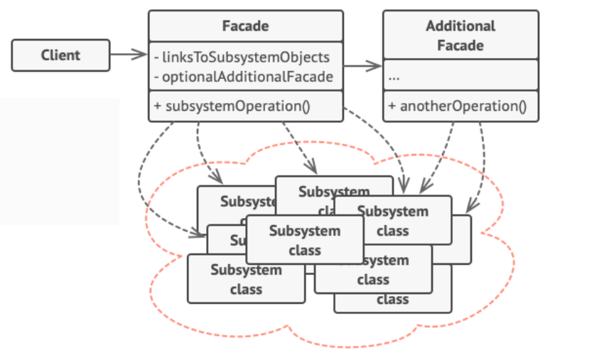

# Sistema de Reservación de Vuelos - Patrón Facade

Este proyecto es una simulación avanzada de un sistema de **reservación de vuelos** implementado en Java utilizando el **Patrón de Diseño Facade**. El objetivo es proporcionar una interfaz simplificada para que el cliente interactúe con múltiples subsistemas sin necesidad de conocer su complejidad interna. Adicionalmente, se ha implementado una **fachada adicional** que maneja ciertas operaciones específicas para separar responsabilidades y hacer que el código sea más modular y mantenible.

<p align="center">
  
</p>

### Subsistemas

El sistema se compone de varios subsistemas que manejan diferentes partes del proceso de reservación de vuelos:

- **AuthenticationSystem**: Autentica al usuario antes de realizar cualquier operación.
- **FlightManagement**: Busca vuelos disponibles según los destinos y la clase seleccionada (económica, business, primera clase).
- **SeatAvailability**: Verifica si hay asientos disponibles en el vuelo seleccionado.
- **PaymentSystem**: Procesa los pagos, valida las tarjetas de crédito y calcula impuestos.
- **NotificationService**: Envía correos electrónicos para notificar a los clientes sobre el estado de sus reservas.
- **RewardSystem**: Gestiona y aplica puntos de recompensa según el monto gastado por el cliente.

### Fachada Principal (BookingFacade)

La clase **BookingFacade** centraliza las operaciones más importantes, como la autenticación, búsqueda de vuelos, verificación de disponibilidad de asientos y procesamiento de pagos. También delega la responsabilidad de manejar las notificaciones y recompensas a la **NotificationRewardFacade**.

```java
// Ejemplo de uso del BookingFacade
BookingFacade bookingFacade = new BookingFacade();
bookingFacade.bookFlight(
    "FrequentFlyer123", "password123", "New York", "Los Angeles", 
    "AA101", "Business", "1234-5678-9876-5432", 800.00, "customer@example.com"
);
```

### Fachada Adicional (NotificationRewardFacade)

La **NotificationRewardFacade** maneja la lógica relacionada con el envío de notificaciones y la aplicación de puntos de recompensa. Esta fachada adicional permite desacoplar ciertas responsabilidades de la fachada principal, haciendo que el código sea más modular y fácil de mantener.

```java
// Ejemplo de uso de la NotificationRewardFacade (internamente usada por BookingFacade)
NotificationRewardFacade notificationRewardFacade = new NotificationRewardFacade();
notificationRewardFacade.applyRewardPoints("FrequentFlyer123", 800.00);
notificationRewardFacade.sendNotification("customer@example.com", "Booking confirmed", true);
```

### Requisitos

- **Java 8** o superior.
- Un IDE o entorno que permita la ejecución de proyectos Java (como IntelliJ IDEA, Eclipse, o la terminal con el compilador `javac`).

## Cómo Ejecutar el Proyecto

1. Clona este repositorio o descarga el código fuente.
2. Importa el proyecto en tu IDE de preferencia.
3. Asegúrate de que el proyecto esté correctamente configurado para usar al menos Java 8.
4. Navega a la clase `Client.java` que se encuentra en el paquete `com.airline.client`.
5. Ejecuta la clase `Client.java`. Esto realizará el proceso completo de reserva de vuelo utilizando la **fachada principal** (BookingFacade) y la **fachada adicional** (NotificationRewardFacade) para manejar recompensas y notificaciones.

El sistema realizará las siguientes operaciones:
- Autenticar al usuario.
- Buscar vuelos disponibles.
- Verificar la disponibilidad de asientos.
- Procesar el pago y calcular impuestos.
- Aplicar puntos de recompensa (usando la fachada adicional).
- Enviar una notificación de confirmación al correo electrónico del cliente (usando la fachada adicional).

## Ejemplo de Salida Esperada

```
Authenticating user: FrequentFlyer123
User authenticated successfully.
Finding flight from New York to Los Angeles in Business class.
Flight found in Business
Checking seat availability for flight: AA101 in Business class.
Seats available in Business
Processing payment with card: 1234-5678-9876-5432
Calculating tax for currency: USD
Payment processed. Total amount with tax: 920.0
Applying 200 reward points for user: FrequentFlyer123
Sending priority email to customer@example.com: Your flight from New York to Los Angeles has been booked in Business class.
Flight booking completed successfully.
```

## Extensiones y Mejora del Proyecto

Este proyecto puede extenderse en varias direcciones para simular un sistema más realista y robusto:

- **Soporte para múltiples métodos de pago**: Agregar soporte para otros métodos como PayPal, Apple Pay, etc.
- **Notificaciones SMS o Push**: Mejorar el sistema de notificaciones para que incluya SMS o notificaciones push.
- **Manejo de errores**: Ampliar el manejo de excepciones y errores para situaciones como vuelos llenos, fallas en los pagos, o problemas de autenticación.
- **Persistencia de Datos**: Integrar una base de datos para almacenar los detalles de las reservas de vuelos.
- **Uso de una API externa**: Conectar el sistema a una API de vuelos para obtener información en tiempo real sobre disponibilidad y precios.
